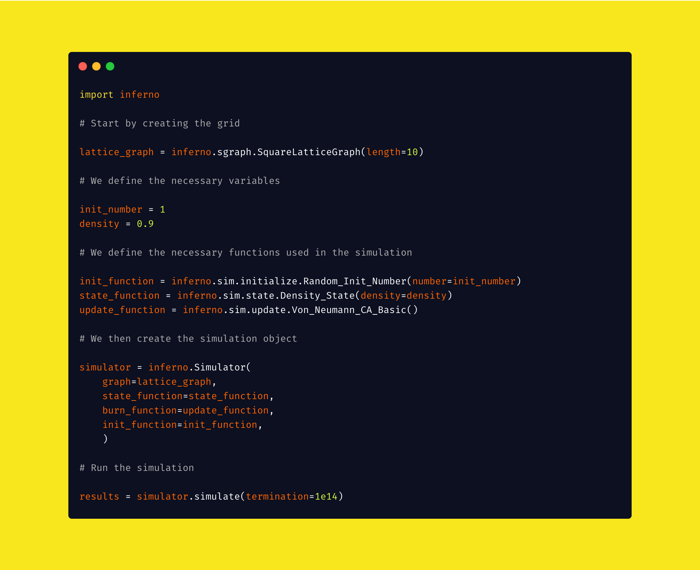

# Forest Fire Engine

THIS LIBRAY IS BEING COMPLETELY OVERHAULED: https://www.overleaf.com/read/dgmgghvhssfv

A collection of code that will be combined with an Arduino-powered robot to detect, predict, and model forest fires.

Disclaimer: We are currently in the process of reworking the entire simulation algorithm and the basis for the mathematical model. The code will constantly be updates, therefore, if you are using any of our libraries, **we will break your code**. We will update this page once the majority of our updates are complete 

**Abstract** 

Despite the havoc wreaked by forest fires, there still are very few platforms in place which predicts the spread of them. In attempts to begin to tackle this issue, a new system will be proposed, entailing a comprehensive algorithm, coupled with a novel detection system. A proof-of-concept autonomous robot will be used to retrieve data from its external environment, and with the use of a probability engine, a real-time simulation of the spread of the fire will be displayed on a monitor, with the robot's relative coordinates. In the end, we were able to create an algorithm running on a mathematical model, and a cellular-autonomic program, along with a functioning robot (equipped with multiple sensors) that relays data back to our program. When the robot came across a fire, it sent out a warning to the computer, and when it was given the coordinates of a fire, the robot and the program attempted to track and model the forest fire. 

For updates on the development of this library, read more at this link: https://lucaman99.github.io/blog/

---

**Current Software**

Inferno: A discrete cellular-automaton simulator for modelling wildfire dynamics.

**Future Software**

Blaze: A continuous statistical simulator for modelling wildfire dynamics.
